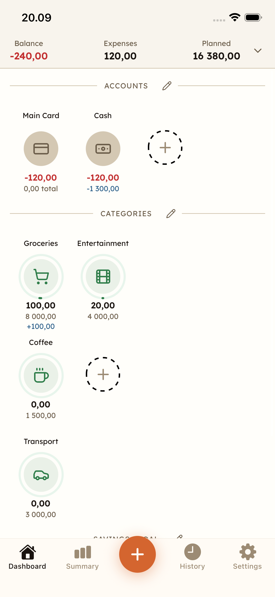
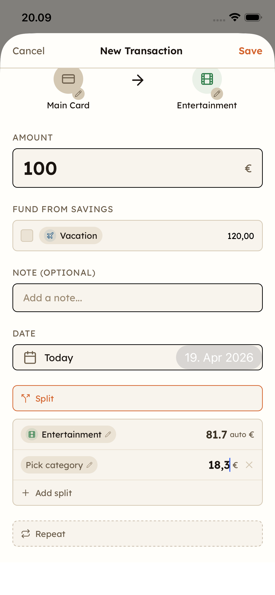
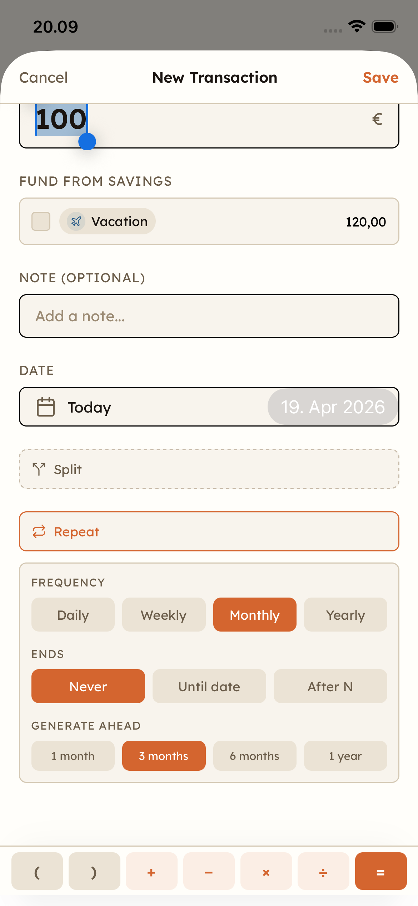
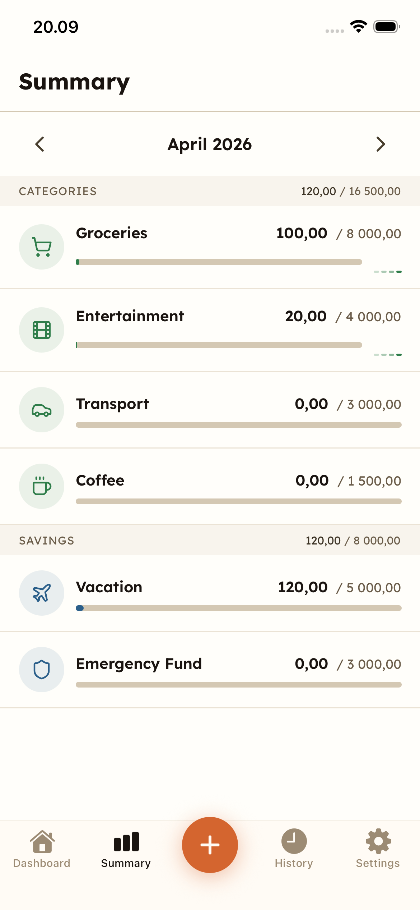
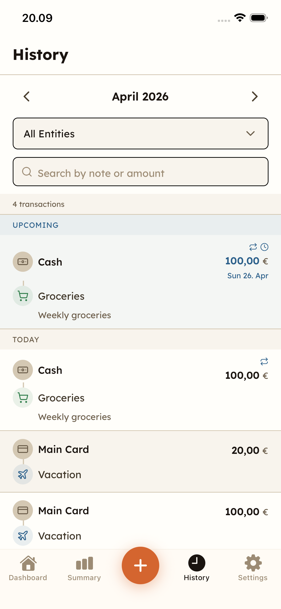

# Kopiika

Offline-first personal finance app for monthly planning vs reality. Built with Expo, React Native, SQLite, and Zustand. Not a bank or budget enforcer — it tracks where money goes, keeps overspending visible, and stays out of the way.

<p align="center">
  
  
  
  
  
</p>

## Features

- **Drag-and-drop dashboard** — income, accounts, categories, and savings as interactive grids; drag one onto another to move money
- **Recurring transactions** — daily, weekly, monthly, or yearly schedules with series edit/delete ("this one" / "all future")
- **Split transactions** — divide a payment across multiple categories in one go
- **Refund flows** — reverse drags trigger refund picker to undo prior transactions
- **Savings reservations** — reserve money from accounts to savings goals; release reserved funds when spending
- **Expression input** — type `100+50` or `200/2` in any amount field
- **Summary with sparklines** — per-entity planned vs actual, 4-month trend, period picker
- **Transaction history** — grouped by day, full-text search, entity filter, inline editing
- **Scheduled transactions** — upcoming transactions visible in history before they land
- **Default account** — pre-selects your main account in transaction flows
- **Quick-add** — floating `+` button in the tab bar opens the transaction modal from anywhere
- **CSV import/export** — full data portability (entities, plans, transactions), managed from Settings
- **In-app changelog** — "What's New" modal on app update
- **Accessibility** — WCAG AA contrast, large touch targets, no color-only indicators

## AI-Assisted Development

One of the goals of this project was to go all-in with AI-assisted development. I spec features — sometimes high-level product requirements, sometimes more detailed technical decisions (library choices, architectural approaches) — and let AI handle the implementation. The [AGENTS.md](AGENTS.md) file configures the AI workflow, and `docs/architecture.md` serves as the shared context that keeps both human and AI aligned on product intent and domain rules.

## Prerequisites

- [Bun](https://bun.sh/) — package manager, scripts, unit test runner
- [mise](https://mise.jdx.dev/) — manages tool versions (Java, Gradle, Ruby) and release tasks
- [Ruby](https://www.ruby-lang.org/) + Bundler — for Fastlane release lanes (installed via mise)
- Xcode (iOS) / Android SDK (Android) — for native builds

## Getting Started

```sh
# Install JS dependencies
bun install

# Install Ruby dependencies (for Fastlane / release tooling)
bundle install

# Install mise-managed tools (gradle, java, ruby, etc.)
mise install

# Start Expo dev server
bun run start

# Run on a specific platform
bun run ios
bun run android
bun run web
```

## Development Commands

| Command                  | What it does                                         |
| ------------------------ | ---------------------------------------------------- |
| `bun run test`           | Run unit tests (Bun) + component/screen tests (Jest) |
| `bun run test:unit`      | Unit tests only (`src/db`, `src/store`, `src/utils`) |
| `bun run test:component` | Component/screen tests only (Jest + RNTL)            |
| `bun run test:coverage`  | Collect coverage from both runners                   |
| `bun run lint`           | Lint with oxlint                                     |
| `bun run format`         | Format with oxfmt                                    |
| `bun run format:check`   | Check formatting without writing                     |
| `bun run types`          | TypeScript type check                                |

## Project Structure

```
app/              Expo Router screens + route-level tests
src/
  components/     Shared UI components
  db/             SQLite / Drizzle persistence
  store/          Zustand state management
  utils/          Business logic helpers
  theme/          Color tokens and theme config
assets/           Static assets (icons, splash, fonts)
docs/             Architecture and release documentation
fastlane/         iOS and Android release lanes
scripts/          Maintenance and build helper scripts
ios/ android/     Native Expo projects
```

## Core Concepts

The domain model has four entity types — **income**, **account**, **category**, and **saving** — connected by immutable **transactions**. Balances are always derived, never stored. Savings reservations are tracked as `account <-> saving` transactions. Recurring transactions are managed through **recurrence templates** that pre-generate future occurrences. Drag-and-drop is the primary interaction.

Full domain rules and data architecture: [docs/architecture.md](docs/architecture.md).

## Releasing

Release tooling is split between two runners:

- **`bun run ...`** — version bumps, changelog generation, app-level scripts
- **`mise run ...`** — signing, store uploads, build-number sync, multi-platform orchestration

Quick release flow:

```sh
mise run release:doctor       # Preflight checks (iOS + Android credentials)
bun run release               # Bump version, sync build numbers, update changelog
mise run release:beta         # Ship iOS + Android betas, notify Telegram
```

Full release guide: [docs/RELEASING.md](docs/RELEASING.md).

## Documentation

| Document                                     | Content                                                               |
| -------------------------------------------- | --------------------------------------------------------------------- |
| [AGENTS.md](AGENTS.md)                       | AI agent workflow, commands, coding conventions, testing guidelines   |
| [docs/architecture.md](docs/architecture.md) | Product intent, domain model, data architecture, interaction rules   |
| [docs/RELEASING.md](docs/RELEASING.md)       | Release flow, signing, store uploads, build cleanup, secrets         |
| [CHANGELOG.md](CHANGELOG.md)                 | Auto-generated release notes from conventional commits               |

## Tech Stack

- [Expo](https://expo.dev/) (SDK 55) + [Expo Router](https://docs.expo.dev/router/introduction/) — framework and file-based navigation
- [React Native](https://reactnative.dev/) 0.83 — cross-platform UI
- [SQLite](https://www.sqlite.org/) via [expo-sqlite](https://docs.expo.dev/versions/latest/sdk/sqlite/) + [Drizzle ORM](https://orm.drizzle.team/) — local persistence
- [Zustand](https://zustand.docs.pmnd.rs/) — state management
- [NativeWind](https://www.nativewind.dev/) + [Tailwind CSS](https://tailwindcss.com/) — styling
- [Bun](https://bun.sh/) — package manager, scripts, unit tests
- [Jest](https://jestjs.io/) + [React Native Testing Library](https://callstack.github.io/react-native-testing-library/) — component/screen tests
- [Fastlane](https://fastlane.tools/) + [mise](https://mise.jdx.dev/) — release automation

## License

[GNU Affero General Public License v3.0](LICENSE)
